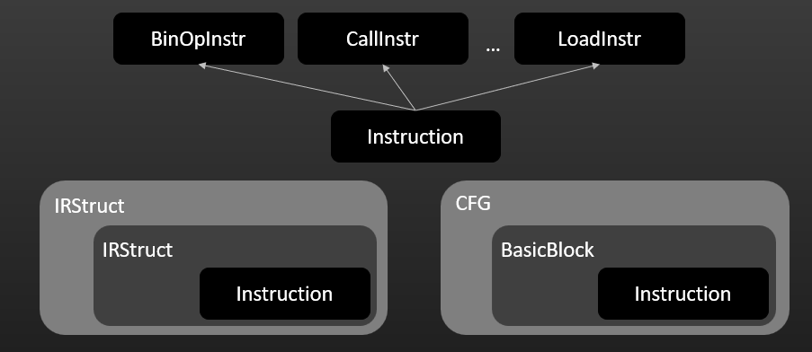

# IR

## About the project

This is the second part to my compiler project where I'll be constructing a tiny intermediate representation for our
stack-based machine. I could have generated simple LLVM IR using the parser I built, but it would not fit well since
the code for LLVM is better written in C++ and my parser is written in Java. However, I don't rule out the possibility
of using LLVM in the future. Finally, if there is any way to improve this project, which I'm sure there is, any feedback
will be appreciated.

## References

* My book of
  choice: [The Dragon Book](https://www.amazon.com/Compilers-Principles-Techniques-Tools-2nd/dp/0321486811).
* I also borrowed some ideas and read some code from these excellent resources:
    * [DoctorWkt on Github](https://github.com/DoctorWkt/acwj)
    * [Bob Nystrom's blog on Pratt's Parser](https://journal.stuffwithstuff.com/2011/03/19/pratt-parsers-expression-parsing-made-easy/)
    * [Matklad's Pratt parser implementation in Rust](https://matklad.github.io/2020/04/13/simple-but-powerful-pratt-parsing.html)
    * [Robert Nystrom's Crafting Interpreters](https://craftinginterpreters.com/)
    * [LLVM project](https://llvm.org/)
* You cannot write a compiler without looking at some other compilers! So I chose the following list of compilers for
  references(mostly on grammar):
    * [C's grammar](https://learn.microsoft.com/en-us/cpp/c-language/c-language-syntax-summary?view=msvc-170)
    * [Swift's grammar](https://docs.swift.org/swift-book/documentation/the-swift-programming-language/summaryofthegrammar#app-top)
    * [Swift's compiler](https://www.swift.org/swift-compiler/)
    * [Kotlin's grammar](https://kotlinlang.org/docs/reference/grammar.html)
* There are also websites that I used to play with Abstract Syntax Tree(AST):
    * [AST Explorer](https://astexplorer.net/)
    * [Swift AST Explorer](https://swift-ast-explorer.com/)

## Computer system basics

There are several phases in the compilation process:

* **Preprocessing**: modifies source code by processing include statements, directives and macros.
* **Compiling**: compiles preprocessed source code to assembly.
* **Assembling**: turns assembly instructions into relocatable machine code.
* **Linking**: links relocatable machine code with code from other object files to produce executables.

## Compiler v.s Interpreter

* **Compiler**: compiles the source language to a low-level target language.
* **Transpiler**: compiles the source language to another high-level target language.
* **Interpreter**: executes the source code, often line by line, to produce some output.
* **Hybrid**: this combines a compiler with an interpreter. For example, Java Virtual Machine(JVM) first compiles Java
  source code to an intermediate representation called bytecodes. JVM's interpreter then executes bytecode instructions
  to produce some output using a stack-based model.

## Compilation phases

* **Lexing(or tokenizing, aka lexical analysis)**: tokenizes the code and splits it into small units called
  tokens similar to how a sentence is tokenized into a list of words.
* **Parsing**: We can divide parsing into two smaller phases.
    * **Syntax analysis**: consumes the tokens and "stitches" them together by following some rules, or
      grammar. The result produced by parser is an abstract syntax tree, or AST.
    * **Semantic analysis**: figures out what the code is trying to do. Some things to do in this phase are
      type checking and resolving references to variables or functions.
* **Code generation**:
    * Traverses the AST to generate intermediate representation(IR) code.
    * Data structures such as control-flow graph(CFG) can then be used to analyze the code.
    * There are two possible ways to process IR code:
        * Build an interpreter to execute each instruction.
        * Map IR code to other representations such as LLVM IR or WebAssembly.

## Components

There are four fundamental components in this project:

* Abstract Syntax Tree(AST).
* Intermediate representation components.
* Control-flow graph(CFG).
* Passes.

## Abstract Syntax Tree(AST)

I wrote briefly about the AST in a file called `README.md` in the [parser](https://github.com/dashluu/parser)
repository.

## Intermediate representation components

I'm not sure if this is a standard practice to structurize the IR, but it is a way that I came up with to organize the
IR into blocks which form some sort of hierarchy. In addition, this step also helps resolve unidentified targets for
jump instructions. The architecture is as follows:

* `Instruction`: represents an IR instruction. There are many classes of instructions, for example, `BinOpInstr` and
  `CallInstr` for binary instructions and calling functions respectively. Each instruction has a reference to the
  containing basic block and IR structure.
* `BasicBlock`: represents a basic block which is a sequence of instructions such that there is no branching except for
  the last instruction or that the first instruction is a target for jumps. A basic block has a reference to the
  containing CFG node(mentioned below). Note that unlike LLVM, a basic block does not have any reference to a function
  or module.
* `IRStruct`: the base class for any IR structures. An IR structure can be a module, a function, a loop statement,
  an if-else sequence, or an if statement. Each IR structure does not have any other references other than one to its
  container, which is another `IRStruct` object.

Currently, the IR hierarchy is shown below:

## Control-flow graph(CFG)

The CFG is used to do code analysis and optimizes it by feeding it through passes as mentioned below. The main data
structures are:

* `CFG`: represents a CFG.
* `CFGNode`: a node in the CFG that holds a reference to a basic block.
* `CFGEdge`: an edge in the CFG that connects two nodes.
* Using the constructed CFG, we can examine the flow of the program and look for optimization opportunities, for
  example, whether a function recursion is present.

## Passes

A pass can be thought as an object that processes the code. The current passes are in chronological order:

* `InstrBuilder`: constructs a list of instructions by traversing the AST.
* `JmpTargetResolver`: resolves any jump target by using the generated hierarchy from the previous pass.
* `BasicBlockBuilder`: builds a list of basic blocks from the constructed list of instructions.
* `CFGBuilder`: builds a CFG from the constructed list of basic blocks. This is still being implemented.

## Other projects

* [parser](https://github.com/dashluu/parser): a simple parser for the compiler's frontend.
* [langtools](https://github.com/dashluu/langtools): a demo web app that combines the parser with the IR generator.